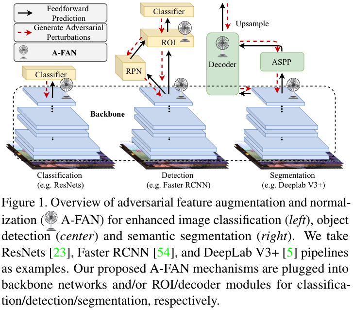
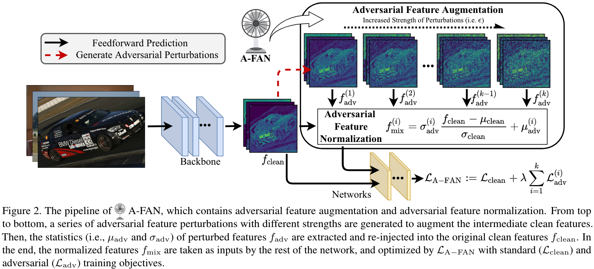

# Adversarial Feature Augmentation and Normalization for Visual Recognition

[](https://opensource.org/licenses/MIT)

Code for this paper [Adversarial Feature Augmentation and Normalization for Visual Recognition](). [TMLR]

Tianlong Chen, Yu Cheng, Zhe Gan, Jianfeng Wang, Lijuan Wang, Zhangyang Wang, Jingjing Liu.


## Overview

**Q1:** *Can adversarial training, as data augmentation, broadly boost the performance of various visual recognition tasks on clean data, not only image classification, but also object detection, semantic segmentation or so?*

**Q2:** *If the above answer is yes, can we have more efficient and effective options for adversarial data augmentation, e.g., avoiding the high cost of finding input-level adversarial perturbations?*




## Methodology




## Main Results

More detailed results of performancing A-FAN on visual recognition tasks (e.g., classification, detection, segmentation) are referred to our paper [here]().


## Reproduce

### Classification

#### Requirements

- pytorch == 1.5.0
- torchvision == 0.6.0
- advertorch

#### Command

```shell
cd Classification
bash cmd/run_test.sh # for testing with a pre-trained model (AFAN model with SA 94.82%)
bash cmd/run_base.sh # for training baseline models
bash cmd/run_perturb.sh # for training ALFA models
```

Remark. 

- Pre-trained models can be downloaded [here](https://www.dropbox.com/sh/gpwk6tc15oni503/AADuwFkjasrozMbd2mMEDrwfa?dl=0).

- For classification experiments, it only support adversarial feature augmentation so far.

### Detection

Detials of Faster RCNN for detection are collected [here](https://github.com/Tianlong-Chen/CV_A-FAN/blob/main/Detection/README.md).

### Segmentation

Detials of DeepLabv3+ for segmentation are collected [here](https://github.com/Tianlong-Chen/CV_A-FAN/blob/main/Segmentation/README.md).

## Citation

```
TBD
```


## Acknowledgement

https://github.com/tensorflow/tpu/tree/master/models/official/efficientnet

https://github.com/lukemelas/EfficientNet-PyTorch

https://github.com/potterhsu/easy-faster-rcnn.pytorch

https://github.com/VainF/DeepLabV3Plus-Pytorch

